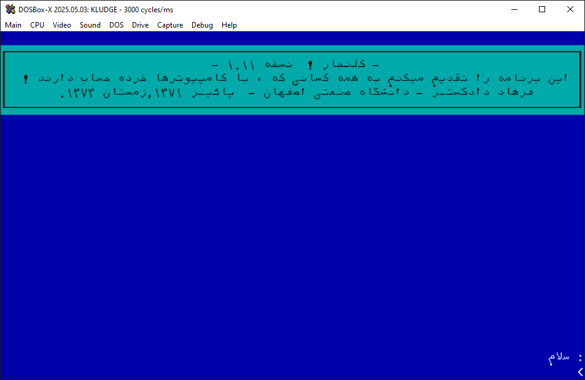

# Kalanjar (کلنجار) — Persian DOS-era Chatbot (Preservation Notes)

**Kalanjar** is an early Persian (Farsi) chatbot from the MS-DOS era (circa 1992–1993).  
It opens in a text UI and chats in Persian. The splash screen credits **Farhad Dadgostar** (Isfahan University of Technology).

> Attribution: created by **Farhad Dadgostar**  
> LinkedIn: https://www.linkedin.com/in/fdadgostar/

This repo preserves our **setup notes** for running Kalanjar on a modern Windows PC, plus pointers for fonts/codepages so Persian text renders correctly.

---

## What we tested

The archive we found contained two variants:

```

kalanjar/
├─ DOS/         ← original DOS build (run via DOSBox-X)
│   ├─ KLUDGE.EXE
│   ├─ RUN.BAT
│   └─ *.DAT (language/logic files)
└─ WIN_XP/      ← Windows port/wrapper (may need VB6 runtime)
└─ kalanjar.exe

````

### File hashes (from our copy)
- `DOS\KLUDGE.EXE` → `4eb8805401645ceb7e60b7e476e1e87a9fc3142987976ee69ca6b88c6361922c`
- `WIN_XP\kalanjar.exe` → `86439cb8a6ffcb449d881d3bd901f4cefa11007ec8c4bf45f14fcc6d602fd8ac`

(These are **SHA-256**; your hashes should match if you have the same build.)

---

## Security check (optional but recommended)

Using Windows Defender (from **cmd**):

```cmd
"%ProgramFiles%\Windows Defender\MpCmdRun.exe" -Scan -ScanType 3 -File "<PATH-TO>\kalanjar"
````

Compute hashes:

```cmd
certutil -hashfile "<PATH-TO>\kalanjar\DOS\KLUDGE.EXE" SHA256
certutil -hashfile "<PATH-TO>\kalanjar\WIN_XP\kalanjar.exe" SHA256
```

---

## Running the DOS version (most compatible)

We had the **best results** with **DOSBox-X** plus a TrueType font and Arabic codepage.

1. Open **cmd** in the folder that contains `DOS\` and `WIN_XP\`, then launch DOSBox-X mounting the **current** directory:

```cmd
"C:\DOSBox-X\dosbox-x.exe" -c "mount c %CD%" -c "c:" -c "dir"
```

2. In the DOSBox-X menu:

* **Video → Select TrueType Font (TTF/OTF)** → `DejaVuSansMono.ttf` (e.g., in `C:\tools\Cygwin\usr\share\fonts\dejavu\`)
* **Video → Output** → choose **OpenGL** (or **Direct3D**)

3. In the DOSBox-X prompt:

```dos
keyb ar
chcp 864
cd DOS
run
```

This renders Persian text correctly; however, **some TUI box-drawing characters may still look off** with DejaVu.



---

## Running the Windows port

Double-click:

```
WIN_XP\kalanjar.exe
```

If it complains about missing VB6 runtime/OCX, install Microsoft’s **Visual Basic 6 runtime**.
Note: you may need **“Language for non-Unicode programs”** set to **Persian (Iran)** for proper window title rendering.

---

## Notes & caveats

* Kalanjar is a historical curiosity; expect simple, rule-based replies.
* Persian input inside DOSBox-X uses the **Arabic keyboard layout** (`keyb ar`).
  If typing commands becomes odd (e.g., `m` prints `,`), temporarily switch back with `keyb us`.
* If your DOSBox-X shows “ASCII characters not defined in TTF font”, your chosen TTF lacks some CP864/box glyphs; switch fonts as suggested above.

---

## Credits

* **Original author:** Farhad Dadgostar — [https://www.linkedin.com/in/fdadgostar/](https://www.linkedin.com/in/fdadgostar/)
* Community preservation & instructions: this repo.

If you own rights to Kalanjar and want us to update/remove files or adjust attribution, please open an issue.

